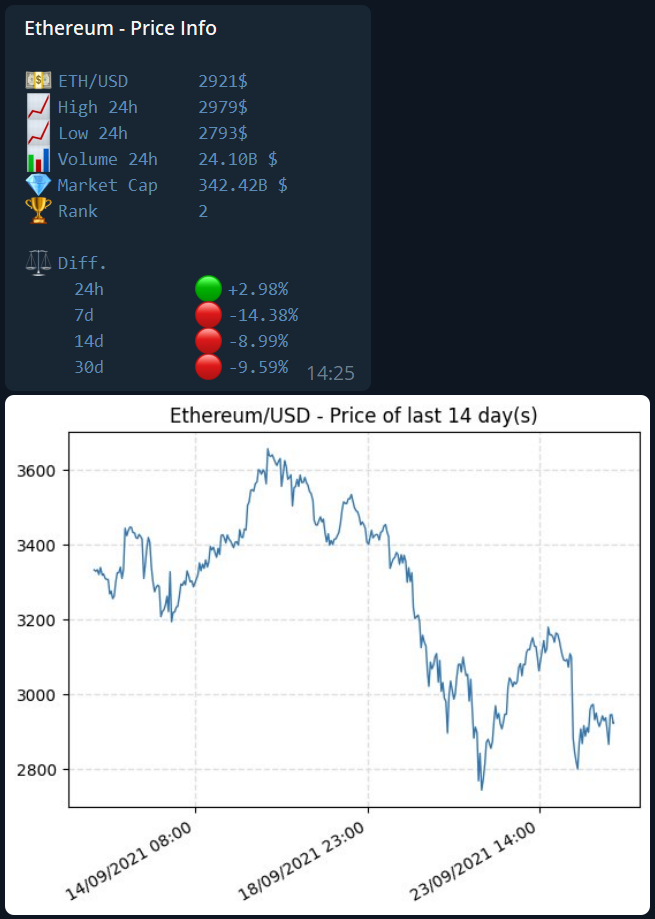
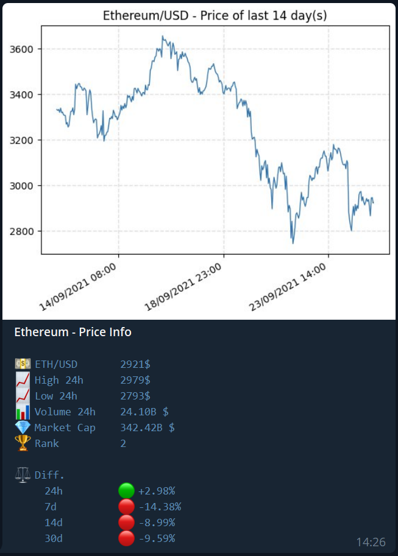

# Telegram Crypto Price Bot

Telegram bot for displaying cryptocurrencies prices and charts based on *pyrogram* and *matplotlib* libraries.\
Data is retrieved using CoinGecko APIs.\
It is possible to show coin information either on demand (by manually calling a command) or periodically using background tasks.\
A single bot instance can be used with multiple coins and in multiple groups.\
The usage of the bot is restricted to admins, in order to avoid users to flood the chat with price requests.

## Setup

### Create Telegram app

In order to use the bot, in addition to the bot token you also need an APP ID and hash.\
To get them, create an app using the following website: [https://my.telegram.org/apps](https://my.telegram.org/apps).

### Installation

The package requires Python 3, it is not compatible with Python 2.\
To install it:
- Using *setuptools*:

        python setup.py install

- Using *pip*:

        pip install telegram_crypto_price_bot

To run the bot, edit the configuration file by specifying the API ID/hash and bot token. Then, move to the *app* folder and run the *bot.py* script:

    cd app
    python bot.py

## Supported Commands

List of supported commands:
- `/help`: show this message
- `/alive`: show if bot is active
- `/pricebot_set_test_mode true/false`: enable/disable test mode
- `/pricebot_is_test_mode`: show if test mode is enabled
- `/pricebot_version`: show bot version
- `/pricebot_get_single COIN_ID COIN_VS LAST_DAYS [SAME_MSG]`: show chart and price information of the specified pair (single call).\
Parameters:
    - `COIN_ID`: CoinGecko *ID*
    - `COIN_VS`: CoinGecko *vs_currency*
    - `LAST_DAYS`: Last number of days to show price chart
    - `SAME_MSG` (optional): true for sending chart and price information in the same message (price information will be a caption of the chart image), false to send them in separate messages. Default value: true.
- `/pricebot_task_start PERIOD_HOURS START_HOUR COIN_ID COIN_VS LAST_DAYS`: start a price task in the current chat. If the task `COIN_ID/COIN_VS` already exists in the current chat, an error message will be shown. To start it again, it shall be stopped with the `pricebot_task_stop` command.\
Parameters:
    - `PERIOD_HOURS`: Task period in hours, it shall be between 1 and 24
    - `START_HOUR`: Task start hour, it shall be between 0 and 23
    - `COIN_ID`: CoinGecko *ID*
    - `COIN_VS`: CoinGecko *vs_currency*
    - `LAST_DAYS`: Last number of days to show price chart
- `/pricebot_task_stop COIN_ID COIN_VS`: stop the specified price task in the current chat. If the task `COIN_ID/COIN_VS` does not exist in the current chat, an error message will be shown.\
Parameters:
    - `COIN_ID`: CoinGecko *ID*
    - `COIN_VS`: CoinGecko *vs_currency*
- `/pricebot_task_stop_all`: stop all price tasks in the current chat
- `/pricebot_task_pause COIN_ID COIN_VS`: pause the specified price task in the current chat. If the task `COIN_ID/COIN_VS` does not exist in the current chat, an error message will be shown.\
Parameters:
    - `COIN_ID`: CoinGecko *ID*
    - `COIN_VS`: CoinGecko *vs_currency*
- `/pricebot_task_resume COIN_ID COIN_VS`: resume the specified price task in the current chat. If the task `COIN_ID/COIN_VS` does not exist in the current chat, an error message will be shown.\
Parameters:
    - `COIN_ID`: CoinGecko *ID*
    - `COIN_VS`: CoinGecko *vs_currency*
- `/pricebot_task_send_in_same_msg COIN_ID COIN_VS true/false`: enable/disable the sending of chart and price information in the same message. If the task `COIN_ID/COIN_VS` does not exist in the current chat, an error message will be shown.\
Parameters:
    - `COIN_ID`: CoinGecko *ID*
    - `COIN_VS`: CoinGecko *vs_currency*
    - `flag`: true for sending chart and price information in the same message (price information will be a caption of the chart image), false to send them in separate messages
- `/pricebot_task_delete_last_msg COIN_ID COIN_VS true/false`: enable/disable the deletion of last messages for the specified price task in the current chat. If the task `COIN_ID/COIN_VS` does not exist in the current chat, an error message will be shown.\
Parameters:
    - `COIN_ID`: CoinGecko *ID*
    - `COIN_VS`: CoinGecko *vs_currency*
    - `flag`: true or false
- `/pricebot_task_info`: show the list of active price tasks in the current chat

By default:
- a price task will send chart and price information in the same message. This can be enabled/disabled with the `pricebot_task_send_in_same_msg` command.
- a price task will delete the last sent message when sending a new one. This can be enabled/disabled with the `pricebot_task_delete_last_msg` command.

The task period starts from the specified starting hour (be sure to set the correct time on the VPS), for example:
- A task period of 8 hours starting from 00:00 will send the message at: 00:00, 08:00 and 16:00
- A task period of 6 hours starting from 08:00 will send the message at: 08:00, 14:00, 20:00 and 02:00

In case of API errors (e.g. network issues or invalid coin ID) an error message will be shown.

**Examples**

Show the price of BTC/USD of the last 14 days in the current chat (single call):

    /pricebot_get_single bitcoin usd 14

Show the price of ETH/BTC of the last 30 days periodically every 8 hours starting from 10:00 in the current chat:

    /pricebot_task_start 8 10 ethereum btc 30

Pause/Resume/Stop the previous task:

    /pricebot_task_pause ethereum btc
    /pricebot_task_resume ethereum btc
    /pricebot_task_stop ethereum btc

Set task so that it sends chart and price information in the same message:

    /pricebot_task_send_in_same_msg ethereum btc true

Set task so that it doesn't delete the last sent message:

    /pricebot_task_delete_last_msg ethereum btc false

## Image Examples

Example with chart and price information on different messages:

Example with chart and price information on the same message:

# License

This software is available under the MIT license.
